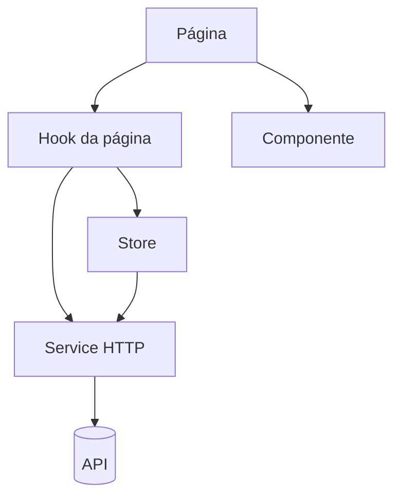

# Arquitetura do frontend

> Exemplo: arquitetura do frontend fictício da loja. Substitua pela do projeto real.

## Camadas

- **Página:** ligada a uma rota; só chama o hook e renderiza o resultado.
- **Hook:** estado, efeitos e chamadas a service ficam fora do JSX.
- **Componente:** UI reutilizável, sem rota própria.
- **Store:** estado de cliente e cache de servidor.
- **Service:** único ponto de acesso à rede.

## Roteamento

Todas as rotas são registradas em um único arquivo e as páginas são carregadas sob demanda. Um layout comum envolve as rotas e exibe um indicador de carregamento enquanto a página chega. Uma rota coringa leva à tela de página não encontrada.

## Estado

- Estado de cliente (carrinho, filtros) em slices.
- Estado de servidor (catálogo, pedidos) em endpoints com cache.
- Estado local de um único componente fica no próprio componente.

A decisão está em [ADR 0001](../adr/0001-state-management.md).

## Estilo

CSS Modules com escopo por arquivo. Tokens globais (cores, fontes) ficam em variáveis CSS num arquivo global; estilo de tela fica no módulo da própria tela.

## Internacionalização

Todo texto visível vem de uma chave de tradução. Os idiomas suportados são português, inglês e espanhol, com o português como língua de referência e o inglês como fallback.

## Testes

- Teste de componente e de página com Testing Library, no ambiente de navegador simulado.
- Teste de hook e de função pura sem renderizar interface.
- Cobertura mínima de 80% exigida no CI.
