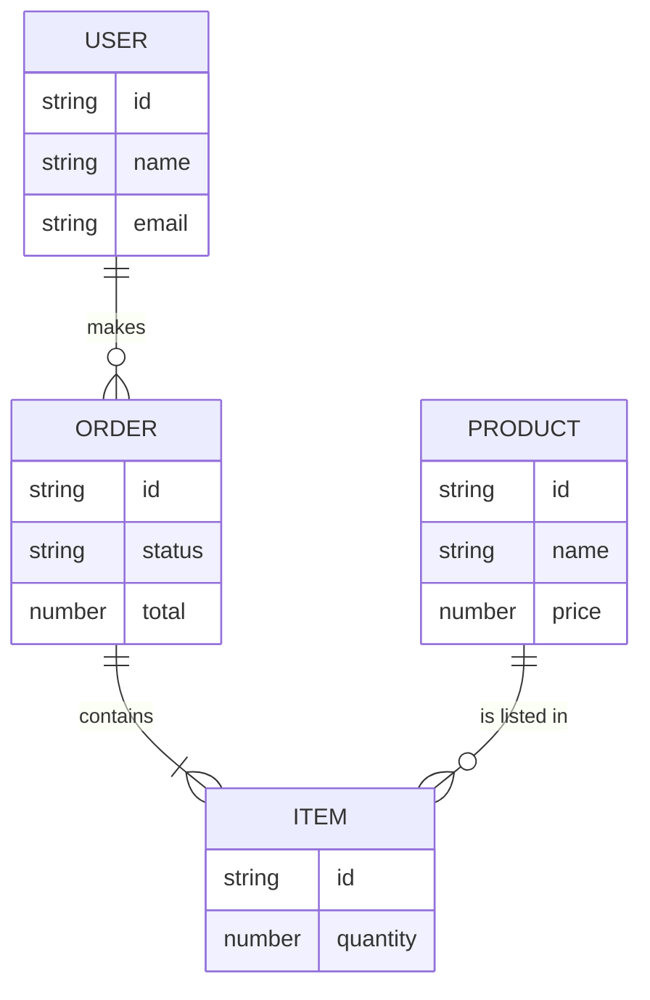

# Entidades

> Exemplo: modelo da loja fictícia. Substitua pelas entidades do projeto.

Use um `erDiagram` para mostrar as entidades que o frontend manipula e como se relacionam.

```mermaid
erDiagram
    USER ||--o{ ORDER : makes
    ORDER ||--|{ ITEM : contains
    PRODUCT ||--o{ ITEM : "is listed in"
    USER {
        string id
        string name
        string email
    }
    ORDER {
        string id
        string status
        number total
    }
    ITEM {
        string id
        number quantity
    }
    PRODUCT {
        string id
        string name
        number price
    }
```
