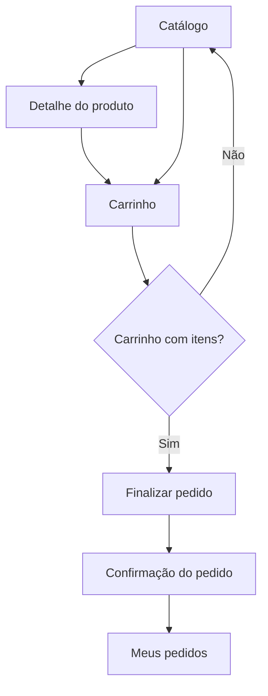

# Fluxo de navegação

> Exemplo: navegação da loja fictícia. Substitua pelo fluxo do projeto.

Use um `flowchart` para mostrar caminhos entre telas e decisões do usuário.

```mermaid
flowchart TD
    Catalog[Catálogo] --> Product[Detalhe do produto]
    Product --> Cart[Carrinho]
    Catalog --> Cart
    Cart --> HasItems{Carrinho com itens?}
    HasItems -- Não --> Catalog
    HasItems -- Sim --> Checkout[Finalizar pedido]
    Checkout --> Confirmation[Confirmação do pedido]
    Confirmation --> Orders[Meus pedidos]
```
