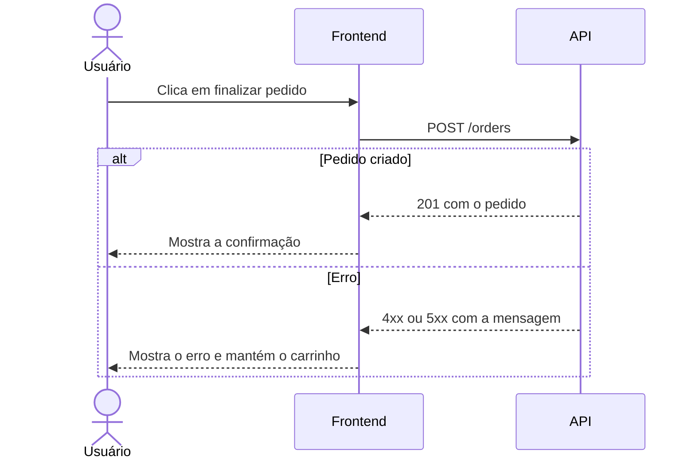

# Sequência: finalizar pedido

> Exemplo: interação da loja fictícia. Substitua pela sequência do projeto.

Use um `sequenceDiagram` para mostrar a ordem das mensagens entre usuário, frontend e API.

